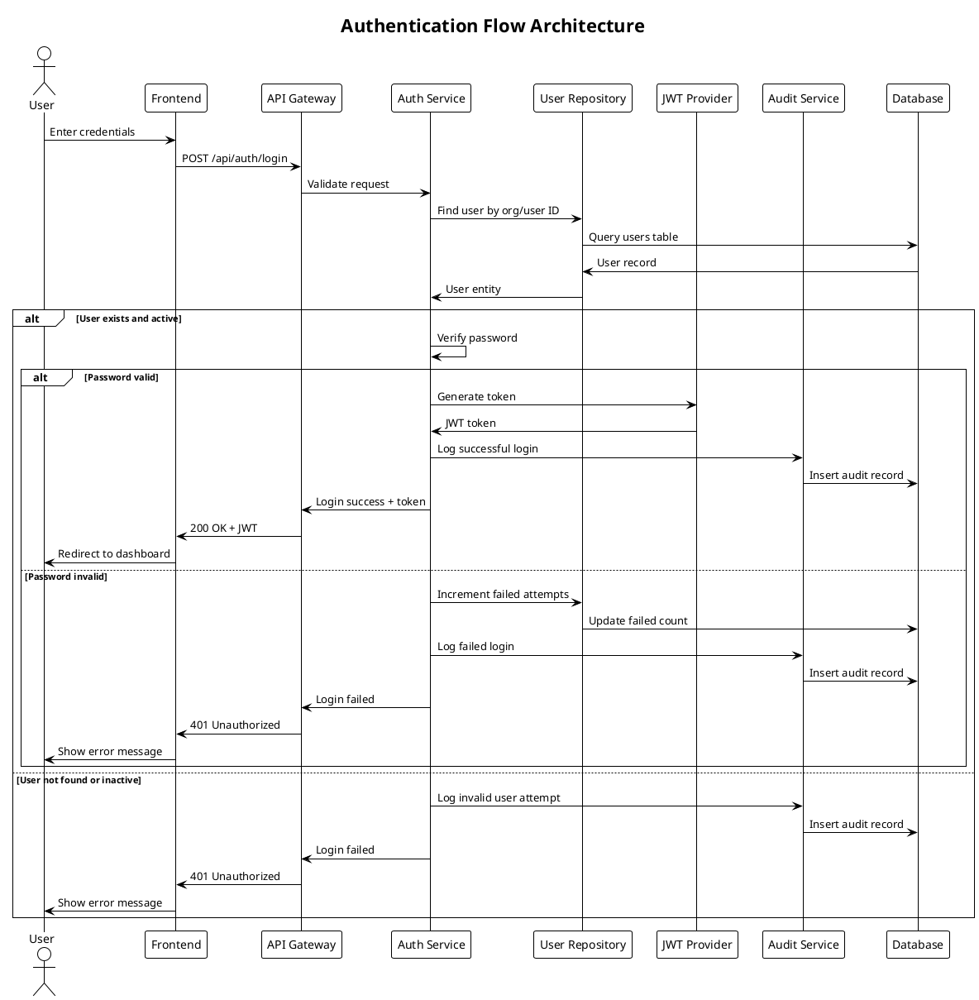
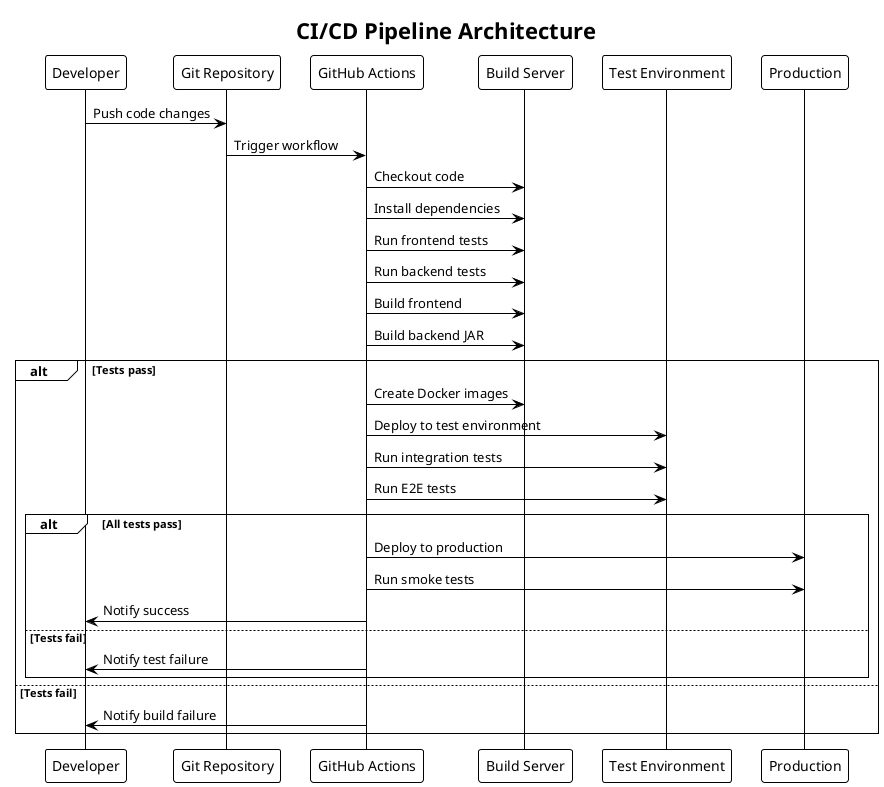

# Architecture Diagrams

## Corporate Internet Banking Login System

### System Architecture Overview

```
┌─────────────────────────────────────────────────────────────────┐
│                     Corporate Internet Banking                   │
│                        System Architecture                       │
└─────────────────────────────────────────────────────────────────┘

┌─────────────────┐    ┌─────────────────┐    ┌─────────────────┐
│   Client Layer  │    │  Security Layer │    │ Integration     │
│                 │    │                 │    │ Layer           │
│ ┌─────────────┐ │    │ ┌─────────────┐ │    │ ┌─────────────┐ │
│ │   Mobile    │ │    │ │    WAF      │ │    │ │    Email    │ │
│ │   Browser   │ │◄───┤ │  Firewall   │ │    │ │   Service   │ │
│ └─────────────┘ │    │ └─────────────┘ │    │ └─────────────┘ │
│ ┌─────────────┐ │    │ ┌─────────────┐ │    │ ┌─────────────┐ │
│ │  Desktop    │ │    │ │    SSL/TLS  │ │    │ │     SMS     │ │
│ │  Browser    │ │◄───┤ │ Certificate │ │    │ │   Gateway   │ │
│ └─────────────┘ │    │ └─────────────┘ │    │ └─────────────┘ │
│ ┌─────────────┐ │    │ ┌─────────────┐ │    │ ┌─────────────┐ │
│ │   Tablet    │ │    │ │    CORS     │ │    │ │    Fraud    │ │
│ │   Browser   │ │◄───┤ │   Policy    │ │    │ │  Detection  │ │
│ └─────────────┘ │    │ └─────────────┘ │    │ └─────────────┘ │
└─────────────────┘    └─────────────────┘    └─────────────────┘
         │                       │                       │
         │                       │                       │
         ▼                       ▼                       ▼
┌─────────────────────────────────────────────────────────────────┐
│                    Application Layer                             │
├─────────────────────────────────────────────────────────────────┤
│                     Frontend (React)                            │
│ ┌─────────────┐ ┌─────────────┐ ┌─────────────┐ ┌─────────────┐ │
│ │    Login    │ │  Password   │ │   Account   │ │    Help     │ │
│ │    Page     │ │    Reset    │ │ Activation  │ │   System    │ │
│ └─────────────┘ └─────────────┘ └─────────────┘ └─────────────┘ │
│                                                                 │
│                    Backend (Spring Boot)                        │
│ ┌─────────────┐ ┌─────────────┐ ┌─────────────┐ ┌─────────────┐ │
│ │    Auth     │ │   Account   │ │   Support   │ │   Audit     │ │
│ │ Controller  │ │ Controller  │ │ Controller  │ │ Controller  │ │
│ └─────────────┘ └─────────────┘ └─────────────┘ └─────────────┘ │
│ ┌─────────────┐ ┌─────────────┐ ┌─────────────┐ ┌─────────────┐ │
│ │    Auth     │ │   Account   │ │   Support   │ │   Audit     │ │
│ │   Service   │ │   Service   │ │   Service   │ │   Service   │ │
│ └─────────────┘ └─────────────┘ └─────────────┘ └─────────────┘ │
└─────────────────────────────────────────────────────────────────┘
                                │
                                ▼
┌─────────────────────────────────────────────────────────────────┐
│                      Data Layer                                 │
├─────────────────────────────────────────────────────────────────┤
│ ┌─────────────┐ ┌─────────────┐ ┌─────────────┐ ┌─────────────┐ │
│ │    User     │ │Organization │ │   Session   │ │    Audit    │ │
│ │Repository   │ │ Repository  │ │ Repository  │ │ Repository  │ │
│ └─────────────┘ └─────────────┘ └─────────────┘ └─────────────┘ │
│                                                                 │
│                      H2 Database                               │
│ ┌─────────────┐ ┌─────────────┐ ┌─────────────┐ ┌─────────────┐ │
│ │    users    │ │organizations│ │  sessions   │ │audit_logs  │ │
│ │    table    │ │    table    │ │    table    │ │   table    │ │
│ └─────────────┘ └─────────────┘ └─────────────┘ └─────────────┘ │
└─────────────────────────────────────────────────────────────────┘
```

### Component Architecture (C4 Model)

#### Level 1: System Context Diagram

```plantuml
@startuml system_context
!include https://raw.githubusercontent.com/plantuml-stdlib/C4-PlantUML/master/C4_Context.puml

title Corporate Internet Banking - System Context

Person(customer, "Corporate Banking Customer", "Business user accessing online banking services")
Person(fraudTeam, "Fraud Investigation Team", "Security team investigating fraudulent activities")
Person(support, "Customer Support", "Support staff helping customers")

System(banking, "Corporate Internet Banking System", "Secure online banking platform for corporate customers")

System_Ext(coreBank, "Core Banking System", "Main banking system processing transactions")
System_Ext(email, "Email Service", "External email service for notifications")
System_Ext(sms, "SMS Gateway", "SMS service for 2FA and alerts")
System_Ext(fraud, "Fraud Detection System", "External fraud monitoring service")

Rel(customer, banking, "Uses", "HTTPS")
Rel(fraudTeam, banking, "Monitors", "HTTPS")
Rel(support, banking, "Supports", "HTTPS")

Rel(banking, coreBank, "Integrates with", "REST API")
Rel(banking, email, "Sends notifications", "SMTP")
Rel(banking, sms, "Sends alerts", "REST API")
Rel(banking, fraud, "Reports activities", "REST API")

@enduml
```

#### Level 2: Container Diagram

```plantuml
@startuml container_diagram
!include https://raw.githubusercontent.com/plantuml-stdlib/C4-PlantUML/master/C4_Container.puml

title Corporate Internet Banking - Container Diagram

Person(customer, "Corporate Banking Customer")

Container_Boundary(banking, "Corporate Internet Banking System") {
    Container(web, "Web Application", "React, TypeScript, Vite", "Single page application providing banking interface")
    Container(api, "API Application", "Spring Boot, Java", "RESTful API handling business logic")
    Container(db, "Database", "H2", "Stores user accounts, sessions, audit logs")
}

System_Ext(email, "Email Service")
System_Ext(sms, "SMS Gateway")
System_Ext(fraud, "Fraud Detection")

Rel(customer, web, "Uses", "HTTPS")
Rel(web, api, "Makes API calls", "JSON/HTTPS")
Rel(api, db, "Reads/Writes", "JDBC")
Rel(api, email, "Sends emails", "SMTP")
Rel(api, sms, "Sends SMS", "REST")
Rel(api, fraud, "Reports events", "REST")

@enduml
```

#### Level 3: Component Diagram - Frontend

```plantuml
@startuml frontend_components
!include https://raw.githubusercontent.com/plantuml-stdlib/C4-PlantUML/master/C4_Component.puml

title Corporate Internet Banking - Frontend Components

Container_Boundary(web, "Web Application") {
    Component(router, "Router", "React Router", "Handles client-side routing")
    Component(login, "Login Component", "React", "User authentication interface")
    Component(activate, "Activation Component", "React", "Account activation wizard")
    Component(reset, "Reset Component", "React", "Password reset workflow")
    Component(help, "Help Component", "React", "Customer support interface")
    Component(auth, "Auth Service", "TypeScript", "Handles authentication logic")
    Component(api, "API Client", "Axios", "HTTP client for API calls")
    Component(store, "State Management", "React Context", "Application state management")
}

Container_Ext(backend, "API Application")

Rel(router, login, "Routes to")
Rel(router, activate, "Routes to")
Rel(router, reset, "Routes to")
Rel(router, help, "Routes to")

Rel(login, auth, "Uses")
Rel(activate, auth, "Uses")
Rel(reset, auth, "Uses")

Rel(auth, api, "Makes requests")
Rel(api, backend, "HTTP calls", "JSON/HTTPS")

Rel(login, store, "Updates state")
Rel(activate, store, "Updates state")
Rel(reset, store, "Updates state")

@enduml
```

#### Level 3: Component Diagram - Backend

```plantuml
@startuml backend_components
!include https://raw.githubusercontent.com/plantuml-stdlib/C4-PlantUML/master/C4_Component.puml

title Corporate Internet Banking - Backend Components

Container_Boundary(api, "API Application") {
    Component(authController, "Auth Controller", "Spring MVC", "Handles authentication requests")
    Component(accountController, "Account Controller", "Spring MVC", "Manages account operations")
    Component(supportController, "Support Controller", "Spring MVC", "Customer support operations")
    
    Component(authService, "Auth Service", "Spring Service", "Authentication business logic")
    Component(accountService, "Account Service", "Spring Service", "Account management logic")
    Component(supportService, "Support Service", "Spring Service", "Support operations logic")
    
    Component(userRepo, "User Repository", "Spring Data JPA", "User data access")
    Component(orgRepo, "Organization Repository", "Spring Data JPA", "Organization data access")
    Component(auditRepo, "Audit Repository", "Spring Data JPA", "Audit log data access")
    
    Component(security, "Security Config", "Spring Security", "Security configuration")
    Component(jwt, "JWT Provider", "JWT Library", "Token generation and validation")
}

Container_Ext(database, "H2 Database")
Container_Ext(email, "Email Service")

Rel(authController, authService, "Uses")
Rel(accountController, accountService, "Uses")
Rel(supportController, supportService, "Uses")

Rel(authService, userRepo, "Uses")
Rel(authService, jwt, "Uses")
Rel(accountService, userRepo, "Uses")
Rel(accountService, orgRepo, "Uses")

Rel(userRepo, database, "Queries", "JDBC")
Rel(orgRepo, database, "Queries", "JDBC")
Rel(auditRepo, database, "Queries", "JDBC")

Rel(authService, email, "Sends notifications")
Rel(accountService, email, "Sends notifications")

@enduml
```

### Security Architecture

```
┌─────────────────────────────────────────────────────────────────┐
│                    Security Architecture                         │
└─────────────────────────────────────────────────────────────────┘

Internet                    DMZ                    Internal Network
   │                        │                           │
   │    ┌─────────────┐     │    ┌─────────────┐        │
   └────┤     WAF     ├─────┼────┤ Load Balancer├───────┤
        │  Firewall   │     │    │             │        │
        └─────────────┘     │    └─────────────┘        │
                           │                           │
                           │    ┌─────────────┐        │
                           └────┤   Reverse   ├───────┤
                                │   Proxy     │        │
                                └─────────────┘        │
                                                      │
        ┌─────────────────────────────────────────────┤
        │                                             │
        ▼                                             ▼
┌─────────────┐                              ┌─────────────┐
│  Frontend   │                              │   Backend   │
│   Server    │◄─────────────────────────────┤   Server    │
│  (Nginx)    │         HTTPS/WSS            │ (Tomcat)    │
└─────────────┘                              └─────────────┘
        │                                             │
        │                                             │
        ▼                                             ▼
┌─────────────┐                              ┌─────────────┐
│   Static    │                              │  Database   │
│   Assets    │                              │   Server    │
│   (CDN)     │                              │    (H2)     │
└─────────────┘                              └─────────────┘

Security Layers:
┌─────────────────────────────────────────────────────────────────┐
│ 1. Network Security: WAF, DDoS Protection, Rate Limiting        │
│ 2. Transport Security: TLS 1.3, Certificate Pinning            │
│ 3. Application Security: JWT, CSRF Protection, Input Validation │
│ 4. Data Security: Encryption at Rest, Secure Password Hashing  │
│ 5. Access Control: Multi-Factor Auth, Session Management       │
│ 6. Monitoring: Audit Logging, Security Event Monitoring        │
└─────────────────────────────────────────────────────────────────┘
```

### Authentication Flow Architecture



### Database Schema Architecture

```sql
-- Database Schema Diagram (Text Representation)

┌─────────────────┐         ┌─────────────────┐
│   organizations │         │      users      │
├─────────────────┤         ├─────────────────┤
│ id (PK)         │◄────────┤ id (PK)         │
│ organisation_id │         │ organisation_id │
│ name            │         │ user_id         │
│ status          │         │ password_hash   │
│ created_at      │         │ account_status  │
│ updated_at      │         │ failed_attempts │
└─────────────────┘         │ last_login      │
                           │ created_at      │
                           │ updated_at      │
                           └─────────────────┘
                                    │
                                    │
                           ┌─────────────────┐
                           │    sessions     │
                           ├─────────────────┤
                           │ id (PK)         │
                           │ user_id (FK)    │◄───┘
                           │ token_hash      │
                           │ expires_at      │
                           │ created_at      │
                           │ last_accessed   │
                           └─────────────────┘
                                    │
                                    │
                           ┌─────────────────┐
                           │   audit_logs    │
                           ├─────────────────┤
                           │ id (PK)         │
                           │ user_id (FK)    │◄───┘
                           │ event_type      │
                           │ event_data      │
                           │ ip_address      │
                           │ user_agent      │
                           │ timestamp       │
                           └─────────────────┘

┌─────────────────┐         ┌─────────────────┐
│  support_cases  │         │   fraud_reports │
├─────────────────┤         ├─────────────────┤
│ id (PK)         │         │ id (PK)         │
│ user_id (FK)    │         │ reporter_id (FK)│
│ case_type       │         │ fraud_type      │
│ description     │         │ description     │
│ status          │         │ status          │
│ created_at      │         │ reported_at     │
│ resolved_at     │         │ investigated_at │
└─────────────────┘         └─────────────────┘
```

### Deployment Architecture

```
┌─────────────────────────────────────────────────────────────────┐
│                   Deployment Architecture                        │
└─────────────────────────────────────────────────────────────────┘

Development Environment:
┌─────────────────┐    ┌─────────────────┐    ┌─────────────────┐
│   Developer     │    │    Frontend     │    │    Backend      │
│   Machine       │    │   Dev Server    │    │   Dev Server    │
│                 │    │                 │    │                 │
│ ┌─────────────┐ │    │ ┌─────────────┐ │    │ ┌─────────────┐ │
│ │   VS Code   │ │    │ │    Vite     │ │    │ │Spring Boot  │ │
│ │    IDE      │ │    │ │  :5173      │ │    │ │   :8080     │ │
│ └─────────────┘ │    │ └─────────────┘ │    │ └─────────────┘ │
│ ┌─────────────┐ │    │ ┌─────────────┐ │    │ ┌─────────────┐ │
│ │    Git      │ │    │ │ Hot Reload  │ │    │ │   H2 DB     │ │
│ │Repository   │ │    │ │   & HMR     │ │    │ │ In-Memory   │ │
│ └─────────────┘ │    │ └─────────────┘ │    │ └─────────────┘ │
└─────────────────┘    └─────────────────┘    └─────────────────┘
         │                       │                       │
         └───────────────────────┼───────────────────────┘
                                │
                                ▼
                    ┌─────────────────┐
                    │   Local CORS    │
                    │ Configuration   │
                    └─────────────────┘

Production Environment:
┌─────────────────────────────────────────────────────────────────┐
│                         Cloud Infrastructure                     │
├─────────────────────────────────────────────────────────────────┤
│ ┌─────────────────┐    ┌─────────────────┐    ┌─────────────────┐ │
│ │   CDN/Static    │    │   Application   │    │    Database     │ │
│ │    Assets       │    │     Server      │    │     Server      │ │
│ │                 │    │                 │    │                 │ │
│ │ ┌─────────────┐ │    │ ┌─────────────┐ │    │ ┌─────────────┐ │ │
│ │ │    React    │ │    │ │   Nginx     │ │    │ │  PostgreSQL │ │ │
│ │ │    Build    │ │    │ │   Reverse   │ │    │ │   Database  │ │ │
│ │ └─────────────┘ │    │ │    Proxy    │ │    │ └─────────────┘ │ │
│ │ ┌─────────────┐ │    │ └─────────────┘ │    │ ┌─────────────┐ │ │
│ │ │ SSL/HTTPS   │ │    │ ┌─────────────┐ │    │ │   Backup    │ │ │
│ │ │Certificate  │ │    │ │Spring Boot  │ │    │ │   System    │ │ │
│ │ └─────────────┘ │    │ │   JAR       │ │    │ └─────────────┘ │ │
│ └─────────────────┘    │ └─────────────┘ │    └─────────────────┘ │
└─────────────────────────────────────────────────────────────────┘
                                │
                                ▼
                    ┌─────────────────┐
                    │   Monitoring    │
                    │   & Logging     │
                    └─────────────────┘
```

### CI/CD Pipeline Architecture



This architecture documentation provides a comprehensive view of the Corporate Internet Banking Login System, covering all major architectural aspects from high-level system context to detailed component interactions and deployment strategies.